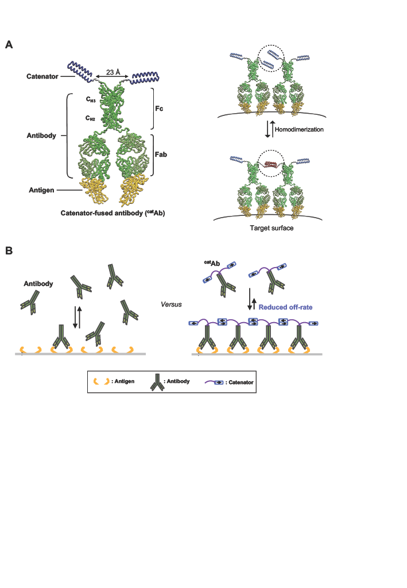
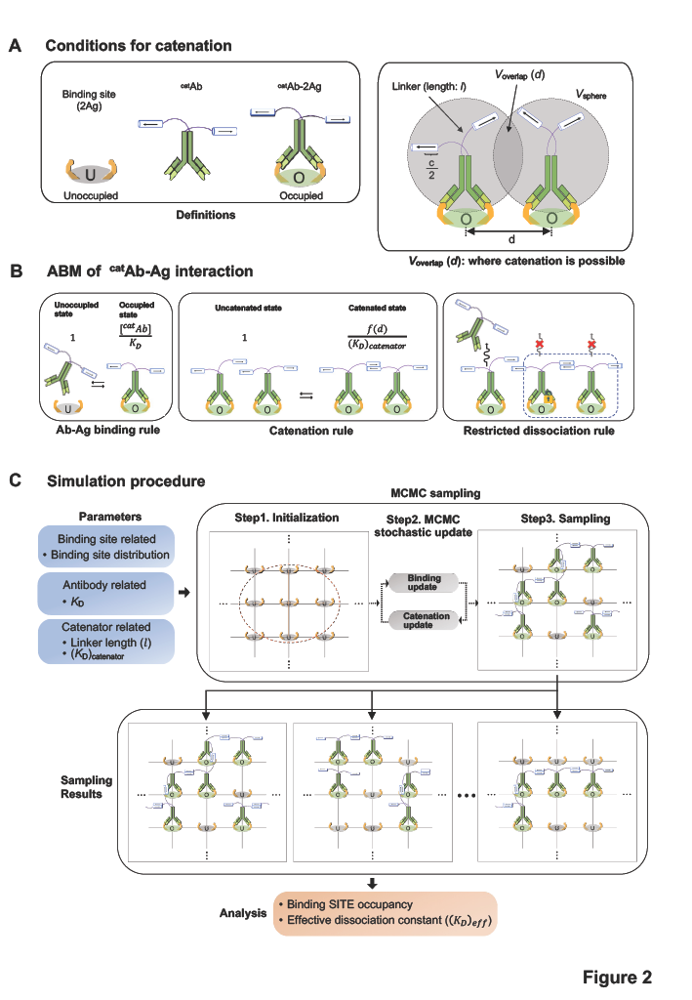

# 2022_AntibodyCatenatedOnSurface

This repository contains the source code for the manuscript "Noncovalent antibody catenation on a target surface greatly increases the antigen-binding avidity" (link: https://www.biorxiv.org/content/10.1101/2022.07.12.499671v1) authored by Jinyeop Song, Bo-Seong Jeong, Seong-Woo Kim, Seong-Bin Im, Seonghoon Kim, Chih-Jen Lai, Wonki Cho, Jae U. Jung, Myung-Ju Ahn, and Byung-Ha Oh. This README file is authored by Jinyeop Song and provides an overview of the repository.

## Overview(Abstract in the manuscript)

Immunoglobulin G (IgG) antibodies are widely used for diagnosis and therapy. Given the unique dimeric structure of IgG, we hypothesized that, by genetically fusing a homodimeric protein (catenator) to the C-terminus of IgG, reversible catenation of antibody molecules could be induced on a surface where target antigen molecules are abundant, and that it could be an effective way to greatly enhance the antigen-binding avidity. A thermodynamic simulation showed that quite low homodimerization affinity of a catenator, e.g. dissociation constant of 100 μM, can enhance nanomolar antigen-binding avidity to a picomolar level, and that the fold enhancement sharply depends on the density of the antigen. In a proof-of-concept experiment where antigen molecules are immobilized on a biosensor tip, the C-terminal fusion of a pair of weakly homodimerizing proteins to three different antibodies enhanced the antigen-binding avidity by at least 110 or 304 folds from the intrinsic binding avidity. Compared with the mother antibody, Obinutuzumab(Y101L) which targets CD20, the same antibody with fused catenators exhibited significantly enhanced binding to SU-DHL5 cells. Together, the homodimerization-induced antibody catenation would be a new powerful approach to improve antibody applications, including the detection of scarce biomarkers and targeted anticancer therapies.

## Workflow & file structure

"Software" folder contains main codes for simulation

"Data" folder contains the raw data

"Analysis" foler contains the processed data for plot

## Usage 

### Dependencies

* Python >= 3.6
* MATLAB

### Operation

For the single run : 

Run main_DataGeneration.m to generate all data that is included in mansucript

Run Experiment_Metropolis_random.m to generate data of randomly distributed antigen binding surface

Run Experiment_Metropolis_structured.m to generate data of regularly distributed antigen binding surface

For the pararell run : 

we used Slurm task manager to pararelly submit the task. In the main directories, .sh files are script for it.

### Input parameters

For The input parameters you must specify effective catneation constant(Kd2_eff), Binding site density(BSdensity), and antigen binding surface size(L)  (more details are in the mansucript)

### Output

Output files is created in the "Result" folder, which contains the simulation results in CSV format. These files include the simulated values of occupied binding site frequency over many replicates.

### Contact Information

For questions or comments about the code, please contact Jinyeop Song at sjinyeop@gmail.com.

